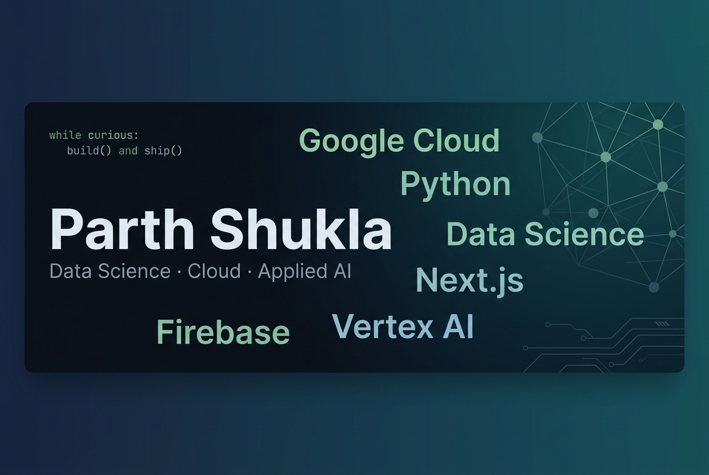

<!-- Banner: upload banner.jpg to the root of your parthinverse/parthinverse repo -->

  

&nbsp;&nbsp;

  

**Data Science @ IIT Madras** &nbsp;·&nbsp; Builder &nbsp;·&nbsp; Cloud &nbsp;·&nbsp; Applied AI &nbsp;·&nbsp; Open Source

 

<!-- Contribution calendar heatmap                                          -->
<!-- Generated by .github/workflows/metrics.yml → committed as             -->
<!-- github-metrics.svg at the repo root (main branch)                     -->

 

- 🛠 &nbsp;Building: **FlowAnchor** (VS Code extension) · **Toolio** (browser app)
- 📚 &nbsp;BS Data Science @ IIT Madras · CGPA 8.9/10 · Diploma in Programming in progress
- ☁️ &nbsp;Stack: Google Cloud · Firebase · Vertex AI · Python · Next.js
- 📬 &nbsp;[25f200444@ds.study.iitm.ac.in](mailto:25f200444@ds.study.iitm.ac.in) · [linkedin.com/in/parthinverse](https://linkedin.com/in/parthinverse)

 

**⚓ FlowAnchor** &nbsp;·&nbsp; VS Code Extension · TypeScript

Preserves and restores developer context when AI coding sessions reset.
Built solo: architecture, implementation, and publishing. On the VS Code Marketplace, recognised as a Microsoft-backed extension.

[GitHub](YOUR_FLOWANCHOR_REPOSITORY_URL) &nbsp;·&nbsp; [Marketplace](YOUR_FLOWANCHOR_MARKETPLACE_URL)

 

**🛠 Toolio** &nbsp;·&nbsp; Browser App · Next.js

Image conversion that runs entirely in the browser.
No server upload, no storage. Files never leave the device.

[GitHub](YOUR_TOOLIO_REPOSITORY_URL) &nbsp;·&nbsp; [Live](YOUR_TOOLIO_LIVE_URL)

 

&nbsp;
&nbsp;
&nbsp;
&nbsp;
&nbsp;
&nbsp;
&nbsp;
&nbsp;
&nbsp;

 

&nbsp;

 

parthinverse · IIT Madras

